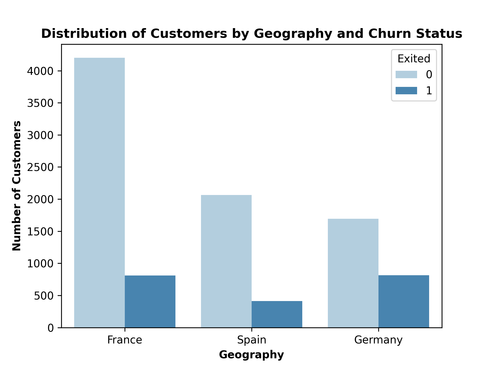
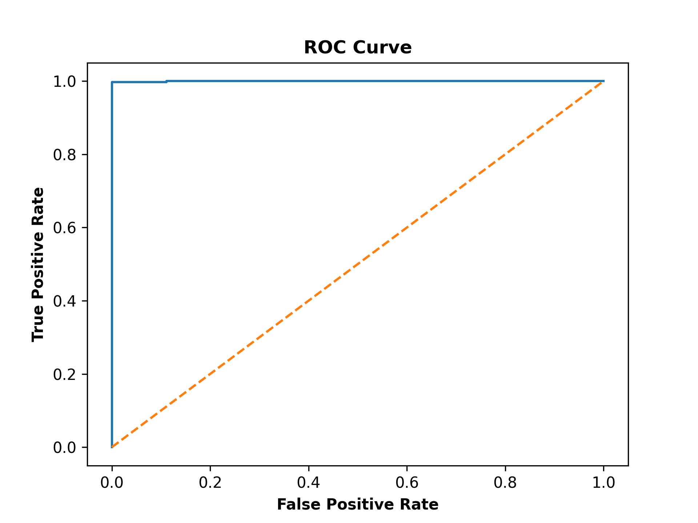

# Customer Churn Analysis using Python

## Project Overview

This project analyzes customer churn behavior in the banking sector using:
- Exploratory Data Analysis (EDA)
- Statistical Modeling
- Logistic Regression
- Machine Learning
- Business Insight Generation

The objective of the project was to identify the major drivers behind customer churn and build a predictive model capable of identifying customers likely to leave the bank.

This project was developed as part of my journey in building capabilities in:
- Data Analytics
- Machine Learning
- Business Intelligence
- Statistical Analysis

---

# Business Problem

Customer churn is one of the biggest challenges faced by banks and financial institutions.

This project attempts to answer:
- Which customers are more likely to churn?
- Which variables significantly affect churn?
- Can churn be predicted using machine learning?
- What strategic actions should the bank take?

---

# Dataset Information

The dataset contains customer-level banking information including:
- Demographics
- Geography
- Credit Score
- Account Balance
- Product Usage
- Customer Activity
- Satisfaction Metrics
- Churn Status

Target Variable:
- `Exited`
    - `1 = Churned`
    - `0 = Retained`

---

# Tools & Libraries Used

```python
import pandas as pd
import matplotlib.pyplot as plt
import statsmodels.api as sm
import seaborn as sns

from sklearn.linear_model import LogisticRegression
from sklearn.model_selection import train_test_split
from sklearn.metrics import (
    classification_report,
    confusion_matrix,
    accuracy_score,
    roc_auc_score,
    roc_curve
)
```

---

# Project Workflow

## 1. Data Exploration

The dataset was first explored to:
- Understand data structure
- Identify null values
- Generate descriptive statistics
- Understand churn distribution

### Code Used

```python
def explore_data(data):
    print(data.head())
    print(data.info())
    print(data.describe())
    print(data.isnull().sum())
```

---

# 2. Customer Churn Analysis

The analysis compared churned and non-churned customers across:
- Age
- Credit Score
- Balance
- Geography
- Satisfaction
- Product Usage

### Key Insights

- Average age of churned customers = 45
- Average age of retained customers = 37
- Churned customers were heavily concentrated in Germany
- Credit score, tenure, satisfaction score and having a credit card showed limited observable impact during exploratory analysis

This suggests older customers are significantly more likely to leave the bank.

---

# 3. Geography-Based Churn Analysis

A visualization was created to analyze churn behavior across countries.

### Code Used

```python
sns.countplot(
    x='Geography',
    hue='Exited',
    data=data,
    palette='Blues'
)

plt.title(
    'Distribution of Customers by Geography and Churn Status',
    fontweight='bold'
)

plt.xlabel('Geography', fontweight='bold')
plt.ylabel('Number of Customers', fontweight='bold')

plt.savefig('geography_churn_distribution.png', dpi=300)
plt.show()
```

---

## Geography Churn Distribution Plot



### Insight

German customers showed significantly higher churn rates compared to customers from France and Spain.

---

# 4. Logistic Regression Analysis

A logistic regression model was developed using `statsmodels` to identify statistically significant predictors of churn.

### Variables Included

- Credit Score
- Geography
- Gender
- Age
- Tenure
- Balance
- Number of Products
- Credit Card Ownership
- Active Membership
- Satisfaction Score
- Reward Points

---

## Logistic Regression Code

```python
model = sm.Logit(y, X)
result = model.fit()

print(result.summary())
```

---

# Statistical Findings

## Variables Increasing Churn Probability

- Higher Age
- Higher Balance
- Being Located in Germany

## Variables Reducing Churn Probability

- Higher Credit Score
- Longer Tenure
- Active Membership
- Being Male

## Statistically Insignificant Variables

- Number of Products
- Credit Card Ownership
- Satisfaction Score
- Reward Points

---

# 5. Predictive Modeling using Scikit-Learn

A machine learning model was built using Logistic Regression.

### Steps Performed

- Train-Test Split
- Model Training
- Prediction
- Performance Evaluation
- ROC Curve Visualization

---

## Predictive Model Code

```python
model = LogisticRegression(max_iter=1000)

model.fit(X_train, y_train)

y_pred = model.predict(X_test)

y_prob = model.predict_proba(X_test)[:, 1]
```

---

# Model Performance

| Metric | Score |
|---|---|
| Accuracy | 99.85% |
| ROC-AUC | 0.9996 |

---

# ROC Curve



---

# Interpretation of Model Performance

The model achieved extremely high predictive performance.

Possible reasons:
- Highly separable data
- Simulated dataset characteristics
- Potential overfitting

Despite this, the model demonstrates strong capability in identifying churn behavior.

---

# Business Recommendations

## 1. Improve Customer Engagement

Active customers were less likely to churn.

### Recommendation
- Increase engagement initiatives
- Improve loyalty programs
- Encourage product interaction

---

## 2. Focus on New Customers

Longer tenure reduced churn likelihood.

### Recommendation
- Improve onboarding experience
- Strengthen early-stage customer relationships

---

## 3. Investigate Older Customers

Older customers were significantly more likely to churn.

### Recommendation
- Conduct customer interviews
- Identify service gaps
- Understand changing financial preferences

---

## 4. Improve Premium Customer Retention

Customers with higher balances showed higher churn probability.

### Recommendation
- Improve premium banking services
- Evaluate wealth management offerings
- Analyze competitor positioning

---

## 5. Germany Requires Strategic Attention

German customers displayed significantly higher churn behavior.

### Recommendation
- Conduct market-specific research
- Evaluate regional customer satisfaction
- Create localized retention strategies

---

# Folder Structure

```bash
├── Customer-Churn-Records.csv
├── Churn_Analysis.py
├── plots/
│   ├── geography_churn_distribution.png
│   └── roc_curve.png
└── README.md
```

---

# Skills Demonstrated

## Technical Skills
- Python
- Pandas
- Data Cleaning
- Data Visualization
- Statistical Analysis
- Machine Learning
- Logistic Regression

## Analytical Skills
- Business Interpretation
- Insight Generation
- Problem Solving
- Decision-Oriented Analytics

---

# Future Improvements

Future versions of the project may include:
- Cross Validation
- Feature Engineering
- Hyperparameter Tuning
- Random Forest & XGBoost
- SHAP Interpretation
- Handling Class Imbalance

---

# About Me

I am an MBA student building capabilities in:
- Data Analytics
- Machine Learning
- Business Strategy
- Decision Science

This repository is part of my analytics and machine learning learning portfolio.
